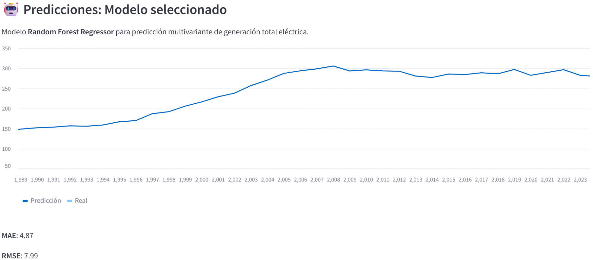
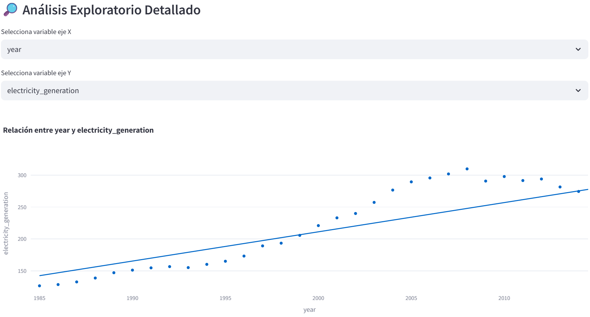

# Predicción de Demanda Energética en España con IA y Datos Abiertos

Este proyecto tiene como objetivo desarrollar un sistema avanzado para predecir la demanda energética y la generación renovable en España. Utiliza datos abiertos de [Our World in Data - Energy Dataset](https://github.com/owid/energy-data) y combina técnicas de limpieza, análisis exploratorio, modelado con Facebook Prophet y machine learning para obtener predicciones fiables y visualizaciones interactivas.

---

## 🚀 Características principales

- 📊 **Datos abiertos** actualizados y procesados para España.
- 🧹 **Limpieza y transformación** de datos con pandas.
- 🔍 **Análisis exploratorio** detallado para entender tendencias históricas.
- 🤖 **Modelado predictivo** con Facebook Prophet para series temporales.
- 📈 **Dashboard interactivo** desarrollado en Streamlit para explorar datos y predicciones.
- 🌿 Análisis detallado de diferentes fuentes de energía: renovables, fósiles, nuclear, etc.

---

## 📂 Estructura del proyecto
```plaintext
energy_demand_forecast/
│
├── data/
│   └── clean/
│       └── energy_spain_clean.csv
│   └── raw/
│       └── energy_spain_raw.csv
├── notebooks/
│   ├── 01_data_download.ipynb
│   ├── 02_data_cleaning.ipynb
│   ├── 03_exploratory_analysis.ipynb
│   ├── 04_model_training
├── src/
│   └── app.py
├── models/
│   ├── prophet_energy_model.joblib
│   ├── rf_energy_model.joblib
├── requirements.txt
└── README.md
```

---

## 📊 Visualizaciones




---

## ⚙️ Instalación y ejecución

1. Clonar el repositorio:
```
bash
git clone https://github.com/fragompul/energy_demand_forecast.git
cd energy_demand_forecast
```

2. Crear entorno virtual e instalar dependencias
```
pip install -r requirements.txt
```

3. Descargar y preparar los datos (opcional si ya existe energy_spain_clean.csv)
```
import pandas as pd
import os

url = "https://raw.githubusercontent.com/owid/energy-data/master/owid-energy-data.csv"
df = pd.read_csv(url)

df_spain = df[df['country'] == 'Spain']
df_spain['date'] = pd.to_datetime(df_spain['year'].astype(str) + '-01-01')

cols = ['date', 'electricity_generation', 'renewables_electricity', 'fossil_electricity',
        'coal_electricity', 'gas_electricity', 'nuclear_electricity', 'oil_electricity',
        'hydro_electricity', 'solar_electricity', 'wind_electricity', 'gdp', 'population']

df_spain = df_spain[cols]

os.makedirs('data/clean', exist_ok=True)
df_spain.to_csv('data/clean/energy_spain_clean.csv', index=False)
```

4. Ejecutar el dashboard
```
cd dashboard
streamlit run app.py
```

---

## 🧠 Tecnologías usadas
- Python (pandas, numpy, matplotlib, seaborn, plotly)
- Modelado con Facebook Prophet
- Dashboard con Streamlit
- Datos abiertos de Our World in Data

---

## 📌 Autor
- Francisco Javier Gómez Pulido
- Correo electrónico: frangomezpulido2002@gmail.com
- Linkedin: www.linkedin.com/in/frangomezpulido
- GitHub: fragompul
